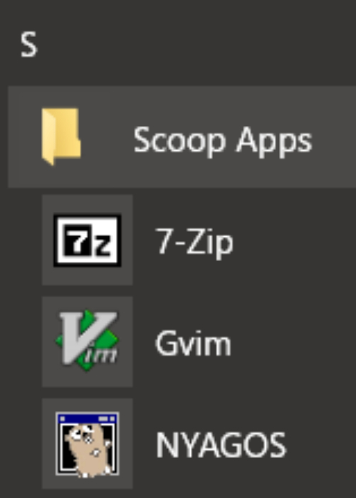

scoop / nyagos で始めるコマンドライン生活
==============

Windows で UNIX ライクな開発環境を整えるとなると、Cygwin , MSYS , MinGW , Windows Subsystem for Linux があります。しかしながら、これらは UNIX/Linux の互換性を第一と考えられているため、本来の Windows 環境との互換性が断絶してしまっており「Windows 向けの作業」をコマンドラインから行う作業に用いるにはつらいという一面があります。

nyagos (Nihongo Yet Another GOing Shell)は Go 言語でスクラッチから作られたコマンドラインシェルです。そのため、パスが Windows で標準の C:\PATH\TO という表記がそのまま使え、CMD.EXE で使えるコマンドがそのまま利用できることを目指しています。それでいてキーバインドが bash や tcsh と同様に Emacs 準拠になっているため、UNIX/Linux に慣れた方でも違和感なく操作ができます。

本書では、scoop という Windows 向けのパッケージ管理システムを通じての nyagos のインストールと必要最小限のセットアップ方法を説明します。あまり個々のツールに仕様に無用に深入りをすることは避けますので、ストレス最小でコマンドライン環境を立ち上げることができるのではないかと思います。

1. [パッケージマネージャ「scoop」のセットアップ](5ac80a9ddb35fef9a146/0.218b39.md)
2. [「nyagos」のインストール](5ac80a9ddb35fef9a146/1.596ba4.md)
3. [git , kaoriya-vim のインストール](5ac80a9ddb35fef9a146/2.c181ec.md)
4. [nyagos で環境変数を設定する](5ac80a9ddb35fef9a146/3.2c4c1e.md)
5. [Windows Terminal で nyagos を使おう](5ac80a9ddb35fef9a146/4.a3f5c9.md)
6. [エイリアスを使おう](5ac80a9ddb35fef9a146/5.cb9842.md)
7. [管理者権限で作業する](5ac80a9ddb35fef9a146/6.44b3aa.md)
8. [クラウドストレージで設定を共有化しよう](5ac80a9ddb35fef9a146/7.74564e.md)
9. [それでも %PATH% はあふれるのだ！](5ac80a9ddb35fef9a146/8.c2e32b.md)
10. [おわりに](5ac80a9ddb35fef9a146/9.bb94d0.md)

