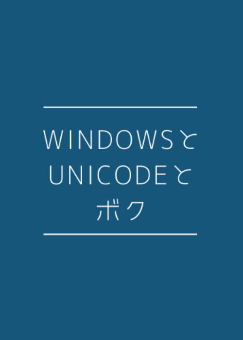

Windows と Unicode とボク
==============

1. [序章 メモ帳ショック！](b820d588f4856bcf836c/0.12bc32.md)
2. [Byte Order Mark とは](b820d588f4856bcf836c/1.6003a9.md)
3. [UTF8 登場前後の Windows の Unicode 事情](b820d588f4856bcf836c/2.47a340.md)
4. [Windows で UTF8 を扱う場合の２つのアプローチ](b820d588f4856bcf836c/3.085021.md)
5. [コマンドプロンプトとサロゲートペア縛り](b820d588f4856bcf836c/4.95bfb9.md)
6. [Unicode の文字幅問題と WindowsTerminal](b820d588f4856bcf836c/5.b8c7c2.md)
7. [APIから入力がとれなかった謎の Unicode 群！](b820d588f4856bcf836c/6.ef707d.md)
8. [合字は糞！Unicodeは糞！（WindowsTerminal）](b820d588f4856bcf836c/7.0637c8.md)
9. [異体字 － 触れ得ざる者（WindowsTerminal）](b820d588f4856bcf836c/8.849ce9.md)
10. [【初版のあとがき】俺たちの戦いはこれからだ！](b820d588f4856bcf836c/9.a3d0a6.md)
11. [DLC1：帰ってきた、謎の Unicode 群](b820d588f4856bcf836c/10.29db17.md)
12. [DLC2: 落ち穂ひろい](b820d588f4856bcf836c/11.a1dacd.md)
13. [DLC3: ZIPファイルと文字化け](b820d588f4856bcf836c/12.103110.md)

