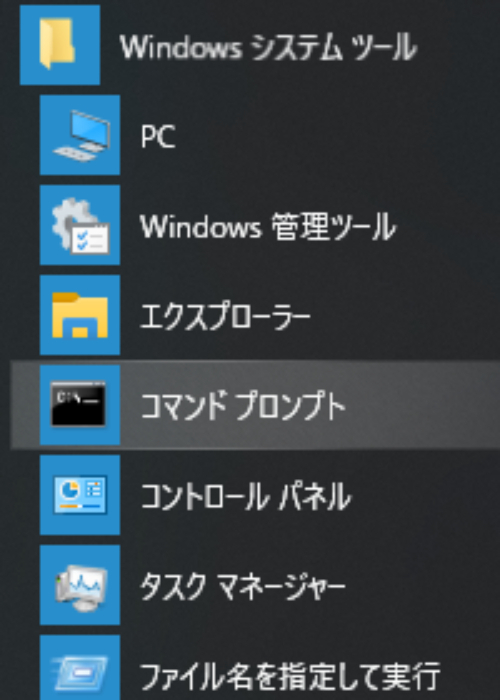

/bin/shに慣れた人に贈るバッチファイルの書き方
==============

今日、Windowsでもバッチファイルが過去の遺物である事は間違いないですが…

●どこでも必ず使えるスクリプトはバッチファイル・VBScript・JScript・PowerShell しかない
●VBScript、JScript 、PowerShell はコマンドプロンプトからではインタプリタ名の指定を必要とする
●さらに PowerShell ではスクリプトの実行許可設定が必要になり、それがないとセキュリティーエラーになる

など「どの環境でも間違いなく、そして手軽に動く」という要件を求めると、バッチファイルかバイナリの実行ファイルにせざるを得ないケースがまだ多いです。幸い、OSがNT系列になってからバッチファイルもかなり高機能になりました。なんとか頑張れば /bin/sh ほどではありませんが、必要なことができそうです。

本書では、これまで自分が学んできたバッチファイル実装のノウハウをニーズからの逆引き形式でご紹介したいと思います。基本的にはOS標準コマンド以外のものは使わないという前提です。

1. [（重要）安全なバッチファイルを書くために](c84cbe23093eee1b5830/0.ce0cbc.md)
2. [（余談）拡張子 .CMD と .BAT の違い](c84cbe23093eee1b5830/1.effa7c.md)
3. [文字列の置換](c84cbe23093eee1b5830/2.3ad07f.md)
4. [コマンド出力の引用](c84cbe23093eee1b5830/3.7c317f.md)
5. [ブロック IF / FOR と環境変数の遅延展開](c84cbe23093eee1b5830/4.2eaf64.md)
6. [ファイルパスをディレクトリ部分・ファイル名部分に分解する](c84cbe23093eee1b5830/5.82fe95.md)
7. [部分文字列の取り出し（例：パス末尾の余分な \ の削除）](c84cbe23093eee1b5830/6.ab34c9.md)
8. [find -exec 相当の処理](c84cbe23093eee1b5830/7.3f7fd4.md)
9. [二重起動防止](c84cbe23093eee1b5830/8.8d8c42.md)
10. [which と find の機能を持つ where.exe](c84cbe23093eee1b5830/9.0bca8b.md)
11. [ファイルのタイムスタンプの取得](c84cbe23093eee1b5830/10.004fee.md)
12. [改行しない出力・複数行出力](c84cbe23093eee1b5830/11.d7b536.md)
13. [実行日の日付の取得](c84cbe23093eee1b5830/12.e77fc6.md)
14. [バッチファイルでサブコマンド](c84cbe23093eee1b5830/13.f5fae9.md)
15. [（極道）バッチファイルだと思った？ ざんねん！PowerShell でした！](c84cbe23093eee1b5830/14.adcc65.md)
16. [戦いはこれからだ！Never End！](c84cbe23093eee1b5830/15.bfdc1f.md)
17. [/bin/sh vs CMD.exe 記号対照表](c84cbe23093eee1b5830/16.ad04cd.md)
18. [管理者権限昇格](c84cbe23093eee1b5830/17.8a78ff.md)
19. [「バッチ ジョブを終了しますか (Y/N)?」](c84cbe23093eee1b5830/18.4f29a0.md)
20. [たまーに必要になる LF → CRLF 改行コード変換](c84cbe23093eee1b5830/19.b85ac6.md)
21. [バッチへの引数から消えるイコール・セミコロン](c84cbe23093eee1b5830/20.parameq.md)
22. [Gitが使える環境ならば、awkやPerlも使えるのです](c84cbe23093eee1b5830/21.gitawk.md)

